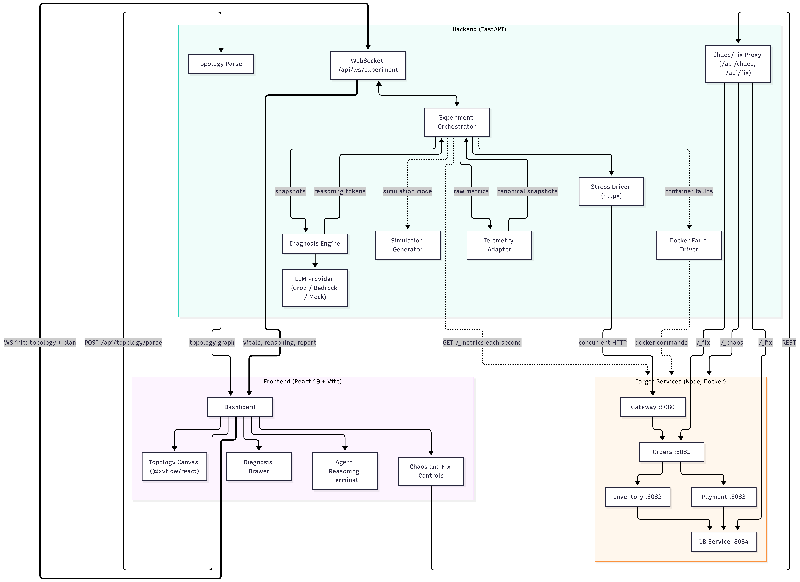
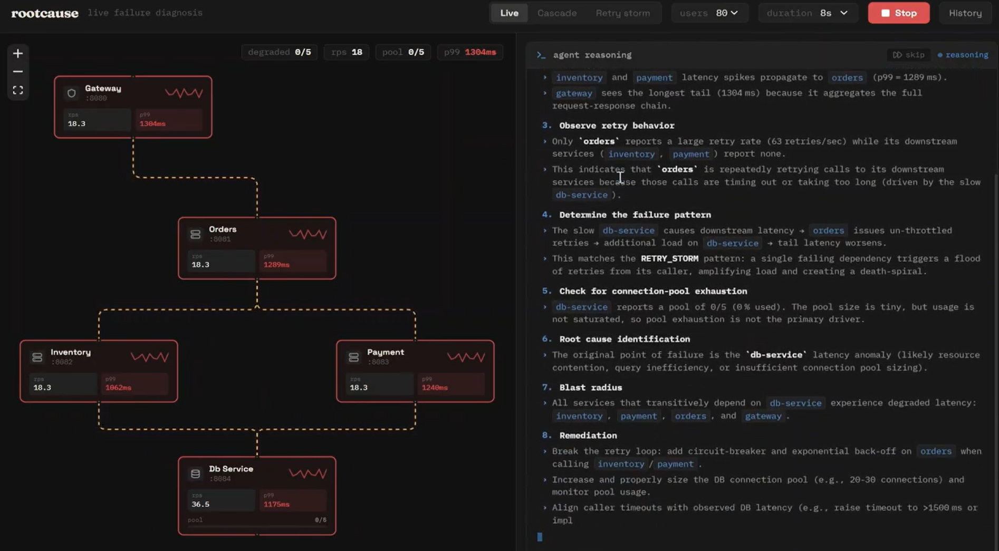
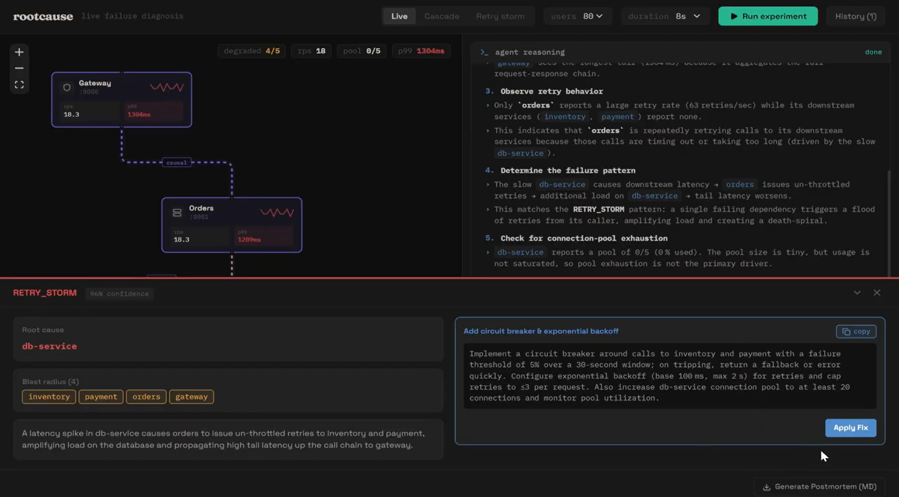
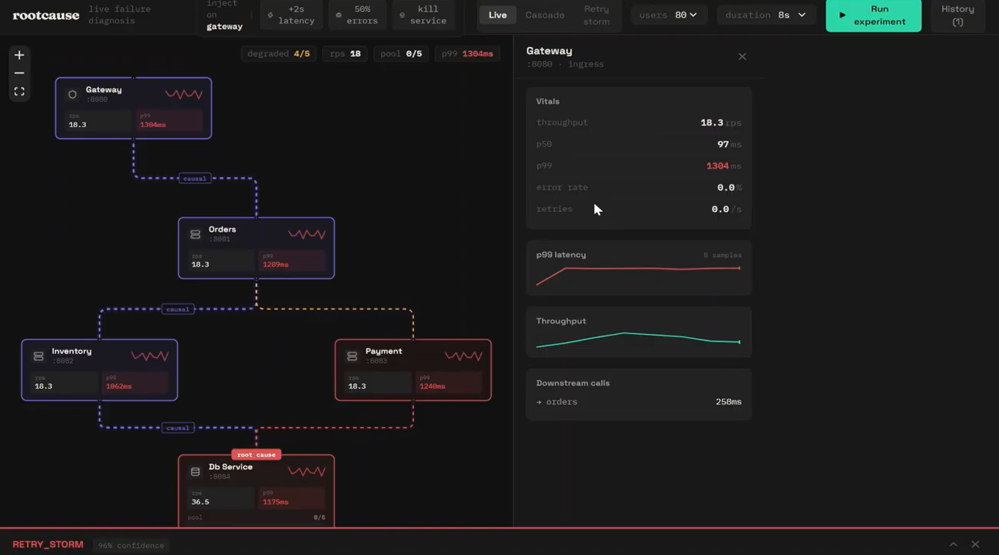

# RootCause

> Break your microservices on purpose, watch the failure spread live, and get an LLM-written root cause analysis with a concrete fix.

[](https://opensource.org/licenses/Apache-2.0)
[](https://python.org)
[](https://fastapi.tiangolo.com)
[](https://react.dev)
[](https://aws.amazon.com/)

**Live Demo**: [https://rootcause.sudolife.in](https://rootcause.sudolife.in/)

---

## The problem
 
A slow database call can exhaust a connection pool, back up two services, and surface as a gateway timeout, while every dashboard shows a different symptom. Chaos tools break things but leave you to piece the story together.
 
RootCause does that part for you. It loads your services, reads their vitals live, and an LLM explains what failed, how far it spread, and how to fix it. No agents, no SDKs, no Prometheus. Each service only exposes `/_metrics`.
 
## Features
 
- Live topology canvas with per-service throughput, p99 latency, errors, and pool usage
- Four stress patterns: `RAMP_UP`, `SPIKE`, `BURST`, `SUSTAINED`
- Click-to-inject latency or errors on any service
- Streaming LLM diagnosis with root cause, blast radius, confidence score, and fix
- Root cause and blast radius highlighted on the graph
- One-click fix, then rerun to compare
- Swappable LLM: Groq, AWS Bedrock, or mock

---

## System Architecture Diagram

---

## Data Flow

1. On load, the frontend sends a `docker-compose.yml` to `POST /api/topology/parse`. The backend returns a `TopologyGraph` (nodes, edges, roles) and the canvas renders it.
2. Clicking **Run experiment** opens a WebSocket and sends the topology plus an experiment plan (pattern, users, duration).
3. The orchestrator starts async HTTP workers against the gateway.
4. Once per second it polls each service's `/_metrics`, and the telemetry adapter normalizes the raw JSON into canonical snapshots.
5. Snapshots stream to the browser as `METRICS_TICK` events and update the graph.
6. When the load phase ends, the diagnosis engine builds a brief from the final snapshots and the dependency graph, and sends it to the LLM.
7. Tokens stream back as `REASONING_CHUNK` events into the terminal.
8. The structured result arrives as a `DIAGNOSIS_REPORT` event and appears in the diagnosis drawer, followed by `COMPLETED`.

## Screenshots





---

## Modes
 
| Mode | What happens | Good for |
|---|---|---|
| **Live** | Real concurrent HTTP traffic against the five target services, with real `/_metrics` polling | Genuine diagnosis of the running system |
| **Cascade** | Scripted cascading-failure telemetry, no live traffic | A reliable demo of `CASCADING_FAILURE` |
| **Retry storm** | Scripted retry-storm telemetry, no live traffic | A reliable demo of `RETRY_STORM` |
 
## Chaos options
 
| Chip | Effect on the selected service |
|---|---|
| `+2s latency` | Every request delayed by 2000 ms |
| `50% errors` | Half of requests return HTTP 500 |
| `kill service` | Simulated outage: 5000 ms latency and 90% errors (the container keeps running) |


---

## Deployment

The project runs on a single AWS EC2 instance with Caddy handling HTTPS and reverse proxying.

### Infrastructure

- **Instance**: AWS EC2 `t3.small` (2 vCPU, 2 GB RAM)
- **OS**: Ubuntu (latest LTS)
- **Storage**: 20 GB EBS
- **Region**: `us-east-1`
- **Reverse Proxy**: Caddy (automatic HTTPS via Let's Encrypt)
- **IAM**: EC2 instance role with `bedrock:*` permissions for LLM access

### Services on the instance

| Service | How it runs | Port |
|---------|------------|------|
| Frontend | Static build served by Caddy | 443 (HTTPS) |
| Backend | uvicorn (FastAPI) | 8000 |
| Gateway | Docker container | 8080 |
| Orders | Docker container | 8081 |
| Inventory | Docker container | 8082 |
| Payment | Docker container | 8083 |
| DB Service | Docker container | 8084 |

### Caddy config (Caddyfile)

```
rootcause.sudolife.in {
    root * /path/to/frontend/dist
    file_server

    handle /api/* {
        reverse_proxy localhost:8000
    }
}
```


## License

Apache 2.0 © 2026 Dhruv Khanna. See [LICENSE](LICENSE) for details.